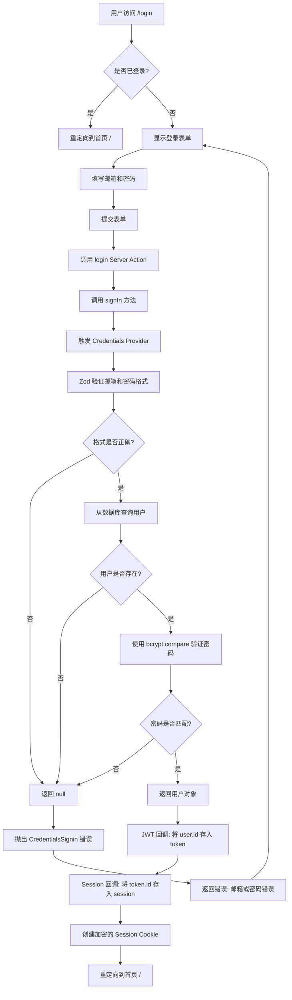
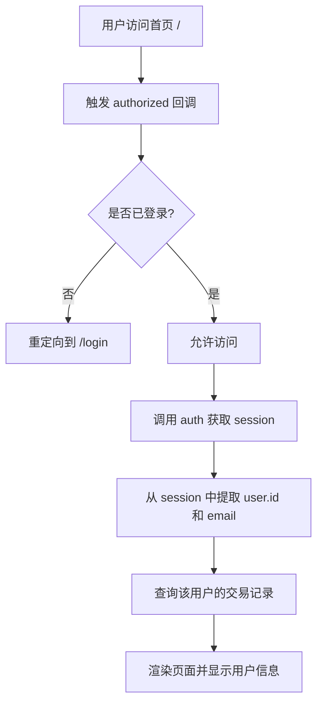
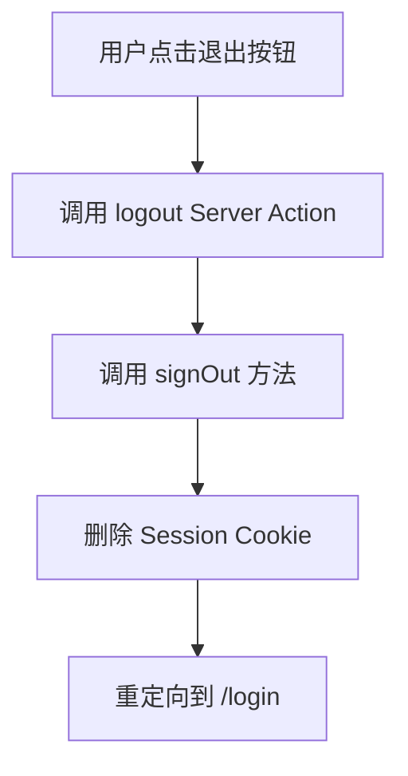

# CashFlow AI - 登录认证系统文档 🔐

## 📋 功能概述

基于 **NextAuth.js v5** 实现的完整用户认证系统，支持邮箱密码注册/登录，使用 bcrypt 加密存储密码，并通过 Prisma 管理用户数据。

---

## 🏗️ 技术栈

- **认证框架**: NextAuth.js v5 (Auth.js)
- **密码加密**: bcryptjs
- **数据验证**: Zod
- **数据库**: PostgreSQL + Prisma ORM
- **状态管理**: React 19 `useActionState` Hook

---

## 📊 认证流程图

### 1. 用户注册流程

```mermaid
graph TD
    A[用户访问 /login] --> B{是否已登录?}
    B -->|是| C[重定向到首页 /]
    B -->|否| D[显示登录/注册表单]
    D --> E[用户点击"去注册"]
    E --> F[切换到注册模式]
    F --> G[填写邮箱和密码]
    G --> H[提交表单]
    H --> I[调用 register Server Action]
    I --> J{邮箱是否已存在?}
    J -->|是| K[返回错误: 邮箱已被注册]
    J -->|否| L[使用 bcrypt 加密密码]
    L --> M[存入数据库 User 表]
    M --> N[自动调用 signIn 登录]
    N --> O{登录是否成功?}
    O -->|是| P[重定向到首页 /]
    O -->|否| Q[返回错误: 注册成功但登录失败]
    K --> D
    Q --> D
```

### 2. 用户登录流程



### 3. 受保护页面访问流程



### 4. 用户退出流程



---

## 🗂️ 文件结构

```
src/
├── app/
│   ├── login/
│   │   └── page.tsx              # 登录/注册页面 UI
│   ├── auth-actions.ts           # 认证相关 Server Actions
│   └── page.tsx                  # 首页（受保护）
├── components/
│   └── UserHeader.tsx            # 用户信息头部组件
├── auth.ts                       # NextAuth 核心配置
└── auth.config.ts                # NextAuth 路由保护配置

prisma/
└── schema.prisma                 # 数据库模型（User + Transaction）
```

---

## 🔑 核心代码解析

### 1. 数据库模型 (`prisma/schema.prisma`)

```prisma
model User {
  id        String   @id @default(cuid())
  email     String   @unique
  password  String   // bcrypt 哈希后的密码
  createdAt DateTime @default(now())
  
  transactions Transaction[]  // 一对多关系
}

model Transaction {
  id        Int      @id @default(autoincrement())
  label     String
  amount    Int
  date      DateTime @default(now())
  userId    String   // 外键
  user      User     @relation(fields: [userId], references: [id], onDelete: Cascade)
}
```

**关键点**:
- `User.id` 使用 `cuid()` 生成唯一 ID
- `email` 设置为唯一索引
- `password` 存储 bcrypt 哈希值（不是明文）
- `onDelete: Cascade` 确保删除用户时自动删除其所有交易

---

### 2. NextAuth 配置 (`src/auth.ts`)

```typescript
export const { auth, signIn, signOut } = NextAuth({
  ...authConfig,
  providers: [
    Credentials({
      async authorize(credentials) {
        // 1. 使用 Zod 验证输入格式
        const parsed = z
          .object({ email: z.string().email(), password: z.string().min(6) })
          .safeParse(credentials);

        if (!parsed.success) return null;

        // 2. 查询数据库
        const { email, password } = parsed.data;
        const user = await prisma.user.findUnique({ where: { email } });
        if (!user) return null;

        // 3. 验证密码
        const passwordsMatch = await bcrypt.compare(password, user.password);
        if (!passwordsMatch) return null;

        return user; // 返回用户对象
      },
    }),
  ],
  callbacks: {
    // JWT 回调：登录时将 user.id 存入 token
    async jwt({ token, user }) {
      if (user) token.id = user.id;
      return token;
    },
    // Session 回调：将 token.id 传递给 session
    async session({ session, token }) {
      if (token?.id && session.user) {
        session.user.id = token.id as string;
      }
      return session;
    },
  },
});
```

**关键点**:
- `authorize` 函数负责验证用户凭证
- 使用 `callbacks` 将 `user.id` 透传到 `session` 中
- 返回 `null` 会触发 `CredentialsSignin` 错误

---

### 3. 路由保护配置 (`src/auth.config.ts`)

```typescript
export const authConfig = {
  pages: {
    signIn: "/login", // 未登录时跳转到登录页
  },
  callbacks: {
    authorized({ auth, request: { nextUrl } }) {
      const isLoggedIn = !!auth?.user;
      const isOnDashboard = nextUrl.pathname === "/"; // 首页受保护

      if (isOnDashboard) {
        return isLoggedIn; // 未登录返回 false，自动跳转到 /login
      } else if (isLoggedIn && nextUrl.pathname === "/login") {
        // 已登录但访问登录页，重定向到首页
        return Response.redirect(new URL("/", nextUrl));
      }
      return true;
    },
  },
  providers: [],
} satisfies NextAuthConfig;
```

**关键点**:
- `authorized` 回调在每次请求时执行
- 返回 `false` 会自动重定向到 `signIn` 页面
- 可以根据路径实现细粒度的权限控制

---

### 4. Server Actions (`src/app/auth-actions.ts`)

#### 注册功能

```typescript
export async function register(prevState: string | undefined, formData: FormData) {
  const email = formData.get("email") as string;
  const password = formData.get("password") as string;

  // 1. 检查邮箱是否已存在
  const exists = await prisma.user.findUnique({ where: { email } });
  if (exists) return "邮箱已被注册";

  // 2. 加密密码（10 轮盐值）
  const hashedPassword = await bcrypt.hash(password, 10);

  // 3. 创建用户
  await prisma.user.create({
    data: { email, password: hashedPassword },
  });

  // 4. 自动登录
  try {
    await signIn("credentials", { email, password, redirectTo: "/" });
  } catch (error) {
    if (error instanceof AuthError) return "注册成功但登录失败";
    throw error;
  }
}
```

#### 登录功能

```typescript
export async function login(prevState: string | undefined, formData: FormData) {
  const email = formData.get("email") as string;
  const password = formData.get("password") as string;

  try {
    await signIn("credentials", { email, password, redirectTo: "/" });
  } catch (error) {
    if (error instanceof AuthError) {
      switch (error.type) {
        case "CredentialsSignin":
          return "邮箱或密码错误";
        default:
          return "登录失败";
      }
    }
    throw error;
  }
}
```

#### 退出功能

```typescript
export async function logout() {
  await signOut({ redirectTo: "/login" });
}
```

**关键点**:
- 必须接收 `prevState` 参数（配合 `useActionState`）
- 使用 `bcrypt.hash(password, 10)` 加密密码
- `signIn` 成功后会自动重定向
- 错误处理通过返回字符串传递给前端

---

### 5. 登录页面 UI (`src/app/login/page.tsx`)

```typescript
export default function LoginPage() {
  const [isLogin, setIsLogin] = useState(true);
  
  // 使用 React 19 的 useActionState
  const [errorMessage, dispatch, isPending] = useActionState(
    async (prevState: string | undefined, formData: FormData) => {
      if (isLogin) return await login(prevState, formData);
      return await register(prevState, formData);
    },
    undefined
  );

  return (
    <form action={dispatch}>
      <input name="email" type="email" required />
      <input name="password" type="password" required />
      
      {errorMessage && <div>{errorMessage}</div>}
      
      <button disabled={isPending}>
        {isPending ? "处理中..." : (isLogin ? "登录" : "注册")}
      </button>
      
      <button type="button" onClick={() => setIsLogin(!isLogin)}>
        {isLogin ? "没有账号？去注册" : "已有账号？去登录"}
      </button>
    </form>
  );
}
```

**关键点**:
- `useActionState` 返回 `[state, dispatch, isPending]`
- `isPending` 用于显示加载状态
- `errorMessage` 自动接收 Server Action 的返回值
- 通过 `isLogin` 状态切换登录/注册模式

---

### 6. 用户信息组件 (`src/components/UserHeader.tsx`)

```typescript
export default function UserHeader({ email }: { email: string | null | undefined }) {
  return (
    <div>
      <User />
      <span>{email || "用户"}</span>
      
      <form action={logout}>
        <button type="submit">
          <LogOut />
        </button>
      </form>
    </div>
  );
}
```

**关键点**:
- 接收 `session.user.email` 作为 props
- 退出按钮直接调用 `logout` Server Action

---

### 7. 首页集成认证 (`src/app/page.tsx`)

```typescript
export default async function Home() {
  const session = await auth(); // 获取当前用户 session
  
  // 使用 session.user.id 查询该用户的交易记录
  const transactions = await getTransactions();
  
  return (
    <main>
      <UserHeader email={session?.user?.email} />
      {/* 其他内容 */}
    </main>
  );
}
```

**关键点**:
- 在 Server Component 中直接调用 `auth()`
- `session.user.id` 可用于查询用户专属数据

---

## 🔒 安全特性

### 1. 密码加密
- 使用 `bcrypt` 加密密码，盐值轮数为 10
- 数据库中只存储哈希值，不存储明文

### 2. Session 管理
- NextAuth 使用加密的 JWT 存储在 HTTP-only Cookie 中
- 防止 XSS 攻击（JavaScript 无法访问 Cookie）

### 3. 输入验证
- 使用 Zod 验证邮箱格式和密码长度
- 前端和后端双重验证

### 4. 路由保护
- 通过 `authorized` 回调实现中间件级别的路由保护
- 未登录用户无法访问受保护页面

### 5. 数据隔离
- 每个用户只能查看和操作自己的交易记录
- 通过 `userId` 外键实现数据隔离

---

## 🎯 关键改进点

### 从 React 18 到 React 19

**旧版本 (useFormState)**:
```typescript
import { useFormState } from "react-dom";
const [state, formAction] = useFormState(action, initialState);
```

**新版本 (useActionState)**:
```typescript
import { useActionState } from "react";
const [state, dispatch, isPending] = useActionState(action, initialState);
```

**优势**:
- 新增 `isPending` 状态，无需手动管理加载状态
- API 更简洁，与 React 核心 Hooks 保持一致

---

## 📝 数据库迁移

### 创建迁移

```bash
npx prisma migrate dev --name add_user_auth
```

### 应用迁移（生产环境）

```bash
npx prisma migrate deploy
```

### 查看数据库

```bash
npx prisma studio
```

---

## 🧪 测试场景

### 1. 注册流程测试

| 场景 | 输入 | 预期结果 |
|------|------|----------|
| 正常注册 | 新邮箱 + 有效密码 | 注册成功并自动登录 |
| 邮箱已存在 | 已注册邮箱 | 显示"邮箱已被注册" |
| 密码过短 | 密码 < 6 位 | Zod 验证失败 |
| 邮箱格式错误 | 无效邮箱 | Zod 验证失败 |

### 2. 登录流程测试

| 场景 | 输入 | 预期结果 |
|------|------|----------|
| 正确凭证 | 正确邮箱 + 密码 | 登录成功，跳转首页 |
| 错误密码 | 正确邮箱 + 错误密码 | 显示"邮箱或密码错误" |
| 不存在的邮箱 | 未注册邮箱 | 显示"邮箱或密码错误" |
| 已登录访问登录页 | - | 自动重定向到首页 |

### 3. 路由保护测试

| 场景 | 操作 | 预期结果 |
|------|------|----------|
| 未登录访问首页 | 直接访问 `/` | 重定向到 `/login` |
| 已登录访问首页 | 访问 `/` | 正常显示页面 |
| 退出登录 | 点击退出按钮 | 跳转到 `/login` |

---

## 🚨 常见问题

### 1. 登录后立即退出

**原因**: `session` 回调未正确传递 `user.id`

**解决方案**: 确保 `auth.ts` 中的 `callbacks` 配置正确

### 2. 密码验证失败

**原因**: 密码未加密或加密方式不一致

**解决方案**: 确保注册时使用 `bcrypt.hash`，登录时使用 `bcrypt.compare`

### 3. 无限重定向

**原因**: `authorized` 回调逻辑错误

**解决方案**: 检查 `auth.config.ts` 中的路由判断逻辑

### 4. Session 中没有 user.id

**原因**: TypeScript 类型定义缺失

**解决方案**: 创建 `types/next-auth.d.ts` 扩展类型：

```typescript
import NextAuth from "next-auth";

declare module "next-auth" {
  interface Session {
    user: {
      id: string;
      email: string;
    };
  }
}
```

---

## 📚 参考资料

- [NextAuth.js v5 官方文档](https://authjs.dev/)
- [Prisma 关系文档](https://www.prisma.io/docs/concepts/components/prisma-schema/relations)
- [bcrypt 加密原理](https://github.com/kelektiv/node.bcrypt.js)
- [React 19 useActionState](https://react.dev/reference/react/useActionState)

---

## ✅ 功能清单

- [x] 用户注册（邮箱 + 密码）
- [x] 用户登录（Credentials Provider）
- [x] 密码加密存储（bcrypt）
- [x] Session 管理（JWT + Cookie）
- [x] 路由保护（Middleware）
- [x] 用户退出登录
- [x] 数据隔离（用户只能看到自己的交易）
- [x] 错误处理（友好的错误提示）
- [x] 加载状态（isPending）
- [x] 自动重定向（登录后跳转首页）

---

## 🎨 UI 特性

- 现代化的登录/注册表单
- 一键切换登录/注册模式
- 实时错误提示
- 加载状态反馈（按钮禁用 + 文字变化）
- 响应式设计
- 用户信息头部组件（显示邮箱 + 退出按钮）

---

**文档版本**: v1.0  
**最后更新**: 2026-01-21  
**作者**: CashFlow AI Team
